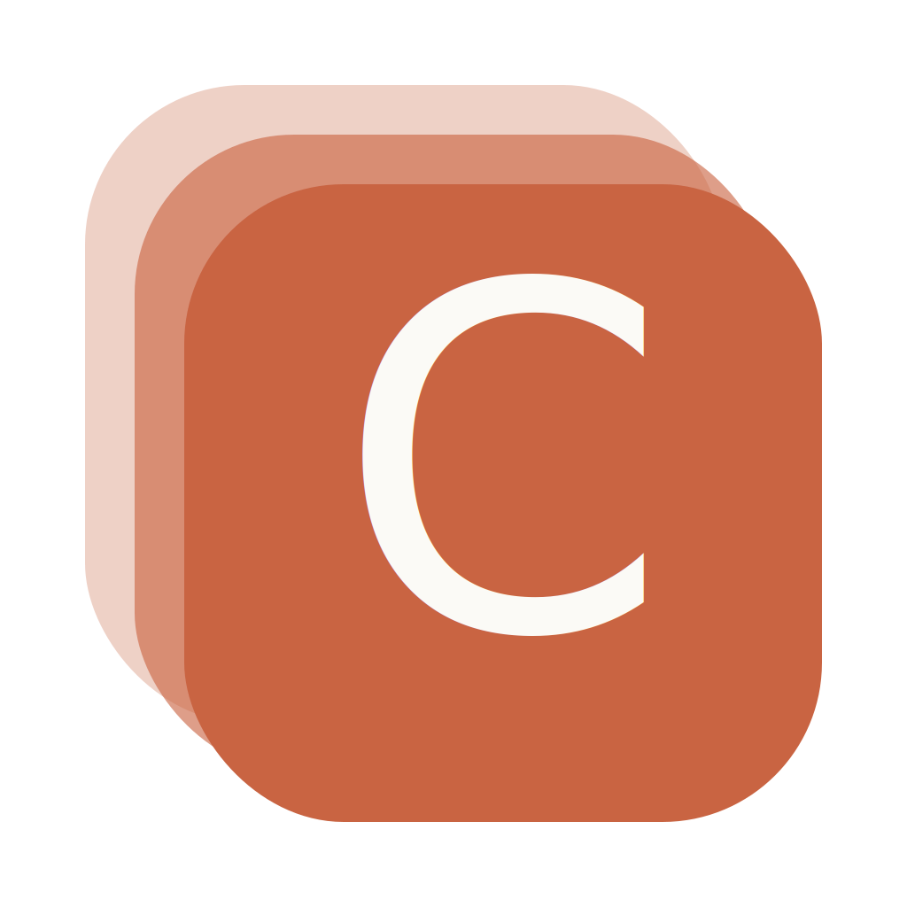
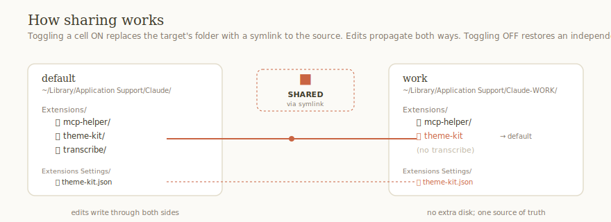
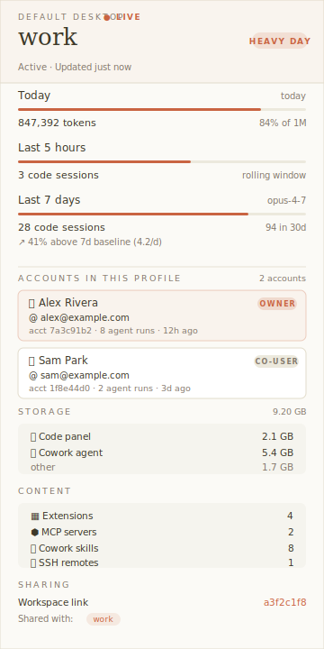

<p align="center">
  
</p>

<h1 align="center">Claudius</h1>

<p align="center">
  Run multiple Claude Desktop and Claude Code accounts side by side on macOS, fully isolated. Each profile keeps its own login, chats, settings, MCP connectors, plugins, and skills — switch between personal, work, and client accounts without signing out.
</p>

<p align="center">
  <a href="https://opensource.org/licenses/MIT"></a>
  <a href="https://github.com/democra-ai/claudius/releases"></a>
  <a href="https://www.apple.com/macos/"></a>
  <a href="https://nodejs.org/"></a>
  <a href="https://v2.tauri.app/"></a>
</p>

<p align="center">
  
</p>

> **Disclaimer.** This is an unofficial community tool. It uses public Electron flags (`--user-data-dir`) and a stable but undocumented Claude Code environment variable (`CLAUDE_CONFIG_DIR`) to keep profiles isolated. Anthropic engineers have engaged on the open feature requests for native multi-account in both apps, so the approach is well known, but it is not officially supported. If a future Claude release changes how profiles work, this tool will need to catch up.

## Features

- **Desktop GUI first** — a Tauri app that shows every profile's content in one matrix. Toggle a cell to share extensions, MCP servers, skills, or workspace history between profiles; the change is staged as pending and applied atomically when you hit Apply.
- **Live "which one is running"** — sidebar polls every 10 s; the profile whose Claude.app process is currently open gets a pulsing dot and a `LIVE` pill. No more "wait, which window am I in?"
- **One click, two apps** — the New Profile flow optionally sets up the Desktop launcher (`Claude WORK.app` on the Dock) *and* the Claude Code CLI (`claude-work` shell alias + isolated `~/.claude-work/` config) in the same step.
- **Honest sharing semantics** — two distinct models. Extensions and Cowork Skills use **live symlinks** so edits propagate both ways. MCP servers and Preferences use **copy-on-apply** because you can't symlink a JSON key. Both write atomically (temp + rename).
- **CodexBar-style profile detail** — right-rail card shows today's tokens, rolling 5h / 7d / 30d session counts, pace vs your own 7-day baseline, per-account identity (owner + co-users with email and accountId), storage breakdown by feature, device id, SSH remote count, and which other profiles share this workspace via symlink.
- **Code & Cowork local records are first-class** — every cwd you've worked in becomes a matrix row showing session counts, last activity, and the most-recent conversation title. Click for the per-profile session list with model badges. Cowork-generated git worktrees get session titles instead of random names like `distracted-matsumoto-3d0a5f`.
- **CLI for power users** — the original interactive wizard is still here, with `add`, `list`, `status`, `extensions`, `repair`, `remove`, and `upgrade`. Use it from scripts, dotfiles, or remote sessions where launching a GUI isn't an option.

## Demo

### Live workspace sharing

<p align="center">
  
</p>

Toggle a cell from ○ to ■ and the target profile's folder is swapped for a symlink at the source's path. Restart Claude, edit the extension in either profile, the change shows up in both. Toggle back and the symlink is replaced with an independent copy.

### Profile detail

<p align="center">
  
</p>

Click a profile name in the sidebar to slide this in. Numbers are mocked but the layout is what you actually get — token count comes from `buddy-tokens.json`, account info from Cowork agent-mode session files, storage from `du -sk` per subtree, workspace link from the `claude-code-sessions/<acct>/<org>/` symlink digest.

## Install

### macOS app (recommended)

Grab the latest `.dmg` from the **[Releases page](https://github.com/democra-ai/claudius/releases/latest)**, double-click to mount, drag **Claudius.app** into `/Applications`.

The bundle is unsigned, so on first launch macOS Gatekeeper will warn — right-click the app and pick **Open**, or run:

```bash
xattr -dr com.apple.quarantine "/Applications/Claudius.app"
```

### CLI

The Node CLI is published from this repo (not yet on npm):

```bash
npm install -g github:democra-ai/claudius
```

Requires Node 18 or newer. The CLI works on both macOS and Linux (the Code half) — the Desktop half is macOS-only because Claude Desktop is macOS-only.

### Build from source

```bash
git clone https://github.com/democra-ai/claudius
cd claudius
npm install                 # root Tauri CLI
npm run frontend:install    # React deps
npm run tauri:dev           # opens the GUI with hot reload
npm run tauri:build         # produces .app + .dmg in src-tauri/target/release/bundle/
```

Requirements: Rust toolchain (`rustup`), Xcode Command Line Tools, Node 18+.

## Quick start

### GUI path

1. Open **Claudius.app**.
2. Sidebar bottom → **NEW PROFILE** → type a name like `work` → check ☑ Desktop launcher and ☑ Code CLI alias → click `+`.
3. A new `Claude WORK.app` lands on `~/Applications/`. Drag it to the Dock.
4. `source ~/.zshrc` (or open a new terminal tab) — the `claude-work` alias is live for Claude Code.
5. **Quit any open Claude windows** with Cmd+Q before first-launching the new profile (see [First-launch checklist](#first-launch-checklist) for why).

### CLI path

```bash
claude-multiprofile add
```

The interactive wizard walks every choice: Desktop only / Code only / both, profile name, where the data goes, whether to seed the new Code config from `~/.claude`. A typical first run is about 30 seconds.

## What gets created

For a profile named `work` with both halves enabled:

```
~/Library/Application Support/Claude-WORK/    ← Desktop data folder
~/Applications/Claude WORK.app                ← Desktop launcher (drag to Dock)
~/.claude-work/                               ← Code config folder
~/.zshrc                                      ← adds: alias claude-work='CLAUDE_CONFIG_DIR=… claude'
~/.config/claude-multiprofile/profiles.json   ← registry entry
```

Nothing about your existing default Claude install changes. Your current login, chats, MCP servers, and skills stay where they are.

## How it works

### Claude Desktop

Claude Desktop is built on Electron. Electron honors the `--user-data-dir` command-line flag, which moves the entire app state (auth tokens, chat list, settings, MCP connectors, projects, custom styles) to a directory of your choosing. Two `.app` launchers pointed at two different data folders give you two fully independent Desktop instances.

The launcher .app is a tiny AppleScript bundle generated by `osacompile`. The script is one line: `do shell script "open -n -a 'Claude' --args --user-data-dir='/path/to/your/profile'"`. The `-n` flag forces a new instance even when Claude is already running.

### Claude Code

Claude Code (the terminal CLI) honors the `CLAUDE_CONFIG_DIR` environment variable. Set it to a folder, and Claude Code reads/writes all of its state (project memory, plugins, skills, MCP servers, slash commands) under that folder instead of the default `~/.claude`.

Authentication is the interesting bit. Claude Code stores its OAuth token in macOS Keychain, keyed by a SHA-256 hash of the active `CLAUDE_CONFIG_DIR`. Different config dir, different keychain entry, completely separate session. You can copy a config folder around (we do — via the "seed from ~/.claude" option) without leaking auth.

### Sharing model A — live symlink

Used for **Extensions** and **Cowork Skills** (and **Code workspace** at the per-Desktop-profile level).

Toggling a cell ON renames the target profile's folder out of the way (backed up) and creates a symlink in its place pointing at the source profile's folder. Both Claude processes read the same bytes on disk; edits made on either side propagate immediately. Toggling OFF removes the symlink and drops a fresh deep-copy in its place — both profiles are now independent again.

### Sharing model B — copy on apply

Used for **MCP servers** (keys in `claude_desktop_config.json`'s `mcpServers` object) and **Preferences** (allowlisted keys in `config.json` and `claude_desktop_config.json`).

You can't symlink a JSON key. So when you toggle a cell ON, the value from source is copied into the target's JSON on Apply. Toggling OFF deletes the key. Writes are atomic (write to `<file>.tmp`, fsync, rename) so a crash mid-write never leaves a half-written config.

## The GUI

### The Grid

The center pane is a matrix: rows are content items, columns are the profiles you've checked on the left. Each cell shows a glyph encoding the share state, double-encoded as a symbol AND a color so it reads at distance and stays legible to colorblind users.

| Glyph | State | Meaning |
|-------|-------|---------|
| ■ | Shared | Live symlink between ≥ 2 profiles — edits propagate |
| ● | Copied | One-shot copy, value currently matches another profile |
| ◐ | Diverged | ≥ 2 profiles have this item with different values |
| ○ | Independent | Present here, not aligned with any other profile |
| · | Absent | Not in this profile |

Rows are grouped by section (PROJECTS, COWORK WORKTREES, ANTHROPIC SKILLS, etc.) — bold uppercase headers borrow Claude.app's own visual language.

### Sidebar

- **CONTENT** kind nav — Code sessions / Cowork sessions / Extensions / MCP servers / Cowork skills / Preferences. Each kind shows `N/M synced` so you can spot misalignment at a glance.
- **PROFILES** list — checkboxes toggle column visibility in the matrix. The currently-running profile (detected via `ps` parsing for the `--user-data-dir` flag) gets a pulsing copper dot and a `LIVE` pill, plus floats to the top of the list. Click the name to slide in the detail panel; click the ▶ that appears on hover to launch.
- **NEW PROFILE** form — name + two checkboxes (Desktop / Code) + an optional "Seed CLI config from ~/.claude" toggle.

### Detail panel

Slides in from the right when you click a profile name or a matrix row.

**For a profile**, you see (everything derived from local files Desktop maintains):

- **Today** — token count from `buddy-tokens.json`, with a bar against a reference scale of 1M tokens.
- **Last 5 hours / 7 days** — code session counts derived from `lastActivityAt` in each session file. The 7-day bar includes a pace indicator: today vs your own 7-day rolling baseline (e.g. "41% above 4.2/d baseline").
- **Accounts in this profile** — list of Anthropic accounts that have left a footprint. The owner (from `cowork-enabled-cli-ops.json`'s `ownerAccountId`) gets a primary-tinted card with `OWNER` chip. Co-users (accounts with their own subdir under `local-agent-mode-sessions/`) get neutral cards with `CO-USER` chip. Name and email come from Cowork agent-mode session files.
- **Storage** — total (via `du -sk -x`) + per-feature breakdown: code panel sessions, Cowork agent sessions, "other" (everything else).
- **Content** — extensions / MCP servers / Cowork skills / SSH remotes counts.
- **Sharing** — workspace symlink target digest (8-hex prefix) and which other profiles share it.
- **Machine** — device id from `ant-did` (base64-decoded UUID), org id from `extensions-blocklist.json`, profile created-at.

**For a matrix row**, you see the same item across all profiles. For Code/Cowork sessions, each present cell expands into the actual session titles (up to 12, with model badge and relative time).

## CLI reference

```bash
claude-multiprofile add                    # interactive wizard (Desktop, Code, or both)
claude-multiprofile list                   # configured profiles + paths + created-at
claude-multiprofile status                 # health-check directories, .apps, aliases
claude-multiprofile extensions <profile>   # multi-select copy Desktop extensions between profiles
claude-multiprofile repair <name>          # re-register a profile launcher with macOS LaunchServices
claude-multiprofile remove [name]          # tear down a profile (data folder kept by default)
claude-multiprofile upgrade                # upgrade the CLI from GitHub
claude-multiprofile help                   # commands + flags
claude-multiprofile --version              # installed version
```

Use `claude-multiprofile add --help` and friends for the per-command flags.

## First-launch checklist

This is the part most guides skip and most users get burned by.

### Desktop: signing in for the first time

Claude Desktop's sign-in flow uses a `claude://` deep link that macOS hands to whichever Claude instance is running. If two are open at once, the auth token can land on the wrong one and you'll end up with both profiles signed into the same account.

The fix is simple but important:

1. Quit any other Claude window with **Cmd+Q** before doing the very first launch of the new profile.
2. Double-click the new launcher (or run `open ~/Applications/Claude\ WORK.app`).
3. Sign in with the account for this profile.
4. Quit (Cmd+Q) once you've confirmed it logged in correctly.

From that point on, both profiles can run simultaneously.

### Code: signing in for the first time

```bash
source ~/.zshrc           # or open a new terminal tab
claude-work               # launches Claude Code with CLAUDE_CONFIG_DIR set
```

Inside the REPL, run `/login`. A browser tab opens. Sign in with the account for this profile. The OAuth token is stored in Keychain under a key derived from the profile's config dir, so it's fully separate from your default account.

## Common patterns

### Per-project default profile

If you always want a specific profile active in a particular repo, drop a `.envrc` (with [direnv](https://direnv.net/)) or a `.env` file:

```bash
export CLAUDE_CONFIG_DIR="$HOME/.claude-work"
```

When you `cd` into the repo, the variable is set automatically. Plain `claude` inside that directory uses the right profile.

### Visual disambiguation

By default, all profile launcher .apps share the Claude icon. To distinguish them on the Dock:

1. Right-click `~/Applications/Claude WORK.app` → Get Info
2. Drag any image onto the small icon in the top-left of the Info window
3. The Dock and Cmd-Tab pick up the new icon within a few seconds

For the terminal side, prefix the alias with a `/color` slash command so the Claude Code REPL prompt is visually distinct:

```bash
alias claude-work='CLAUDE_CONFIG_DIR=~/.claude-work claude -e "/color blue"'
```

### Sharing skills between profiles

The GUI's Cowork Skills tab does this with a click. If you'd rather symlink it yourself:

```bash
rm -rf ~/.claude-work/skills
ln -s ~/.claude/skills ~/.claude-work/skills
```

The same trick works for plugins or any sub-folder. Be careful with `projects/` if you want chat history to stay separate — that's the folder you do *not* want shared.

## Troubleshooting

**The new Desktop profile launched already signed into my other account.**

You launched it while the other Claude instance was running. The `claude://` auth deep link got routed to the wrong app. Fix:

```bash
rm -rf ~/Library/Application\ Support/Claude-WORK
```

Then quit ALL Claude windows (Cmd+Q) and launch the new profile again.

**The launcher icon stopped responding to double-clicks but `open` from terminal still works.**

Stale macOS LaunchServices cache. Run:

```bash
claude-multiprofile repair <profile-name>
```

This re-registers the .app and refreshes the icon cache.

**The shell alias isn't found.**

Aliases load when a shell starts. Open a new terminal tab or `source ~/.zshrc`. Run `claude-multiprofile status` to confirm the alias is in the rc file.

**I want to see what's in the registry.**

```bash
cat ~/.config/claude-multiprofile/profiles.json
```

Plain JSON; safe to inspect or hand-edit.

**I'm on Linux.**

The Code half works fine on Linux, the Desktop half doesn't (Claude Desktop is macOS-only). The wizard skips Desktop questions on non-macOS automatically. The Tauri GUI is currently macOS-only too.

## Comparison with similar tools

| Tool | Desktop | Code | GUI | Mac | Linux | Notes |
|------|---------|------|-----|-----|-------|-------|
| **Claudius** (this) | yes | yes | **yes** | yes | partial | Single tool, content matrix GUI, optional CLI |
| [aimux](https://github.com/Digital-Threads/aimux) | no | yes | no | yes | yes | Code only, also handles symlink-sharing |
| [aisw](https://crates.io/crates/aisw) | no | yes | no | yes | yes | Rust binary, covers Codex CLI and Gemini CLI |
| [Jean-Claude](https://madewithlove.com/blog/running-multiple-claude-accounts-without-logging-out/) | no | yes | no | yes | yes | Cross-machine sync, opinionated dotfiles |
| Manual setup | yes | yes | no | yes | yes | Documented in [several](https://daring-designs.com/blog/how-to-run-multiple-claude-code-accounts-side-by-side) [places](https://wmedia.es/en/tips/claude-code-multiple-profiles-config-dir) |

## What we don't show

Claude's 5-hour and weekly usage quotas live in IndexedDB's binary protobuf blobs, which Claude.app holds open with an exclusive lock while running. Reading them reliably would mean either reverse-engineering Anthropic's private wire format (fragile, breaks on every Claude update) or pulling the OAuth token from Keychain to query the Anthropic API directly — which would defeat the entire point of profile isolation. We deliberately don't.

What you **do** get is everything derivable from local files Desktop maintains: token-count-today from `buddy-tokens.json`, rolling 5h / 7d / 30d session counts computed from session-file timestamps, a pace-vs-baseline indicator that's your own week-over-week trend, and the per-profile storage / content / sharing readouts described above.

## Security notes

The tool reads and writes the following on your machine:

- `~/Library/Application Support/Claude-{Name}/` (creates new folders only)
- `~/Applications/` (creates new .app bundles only)
- `~/.claude-{name}/` (creates new folders only)
- `~/.zshrc` (adds a delimited managed block; never touches lines outside the markers)
- `~/.config/claude-multiprofile/profiles.json` (the registry)

It does **not** touch:

- Your default Claude data folder (`~/Library/Application Support/Claude/`) — except to read it for seeding, never to write
- Your default `~/.claude` — same
- macOS Keychain — Claude Code's auth lives there but the tool never reads or writes Keychain entries
- IndexedDB / Local Storage / Cookies in any Claude data folder
- Anything else on your filesystem

The single runtime npm dependency for the CLI is `@inquirer/prompts`. The Tauri app's release bundle vendors its own runtime; no Node required to run it.

## Tech stack

| Layer | Tool |
|-------|------|
| Desktop runtime | [Tauri 2](https://v2.tauri.app/) (Rust) |
| macOS chrome | [tauri-plugin-decorum](https://github.com/clearlysid/tauri-plugin-decorum) for single-row title bar with inset traffic lights |
| Frontend | [React 18](https://react.dev/) + [Vite](https://vitejs.dev/) + TypeScript |
| Styling | [Tailwind CSS](https://tailwindcss.com/) + [shadcn/ui](https://ui.shadcn.com/) primitives |
| Typography | [Fraunces](https://fonts.google.com/specimen/Fraunces) (display serif) · [Geist](https://vercel.com/font) (body) · [JetBrains Mono](https://www.jetbrains.com/lp/mono/) (ids/paths) |
| CLI | Node 18+, [@inquirer/prompts](https://www.npmjs.com/package/@inquirer/prompts) |

## Contributing

Issues and PRs welcome. The codebase is structured for newcomers — the CLI is one file per command in `src/commands/`, the Tauri backend lives in `src-tauri/src/lib.rs`, and the React UI is broken into small focused components under `frontend/src/components/`.

```bash
git clone https://github.com/democra-ai/claudius
cd claudius
npm install
npm test                       # CLI unit tests
cd src-tauri && cargo test     # Rust unit tests
cd ../frontend && npm install && npm run typecheck
```

Pre-commit checks (run before opening a PR):

```bash
cd src-tauri && cargo test --lib   # all 34+ tests should pass
cd ../frontend && npm run typecheck && npm run build
```

## Acknowledgments

- **CLI foundation** from the upstream [claude-multiprofile by @jmdarre-v](https://github.com/jmdarre-v/claude-multiprofile) — the wizard, registry, macOS launcher generation, and shell-alias handling are derived from his work. MIT-licensed; preserved here under the same terms.
- **[tauri-plugin-decorum](https://github.com/clearlysid/tauri-plugin-decorum)** by @clearlysid — single-row macOS title bar with properly inset traffic lights, wrapping the NSWindow Objective-C calls so we don't have to.
- **Anthropic** — for the Claude Desktop / Claude Code apps this tool extends. Multi-account is in the open issue queue ([Desktop](https://github.com/anthropics/claude-code/issues/32783), [Desktop UI](https://github.com/anthropics/claude-code/issues/18435)); until it ships natively, this tool fills the gap.

## License

MIT — see [LICENSE](./LICENSE). The original copyright lines from the upstream fork are preserved.
